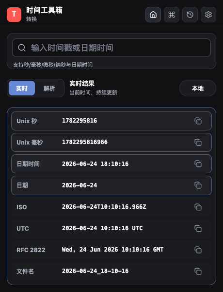
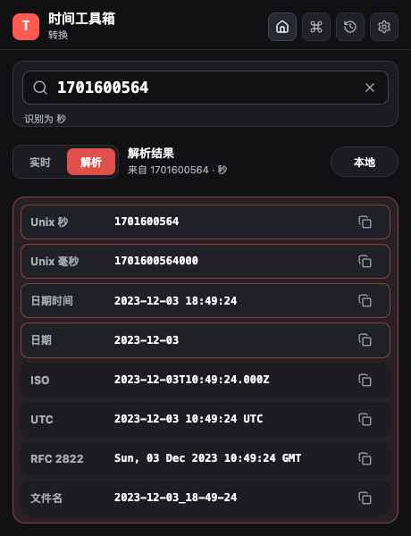
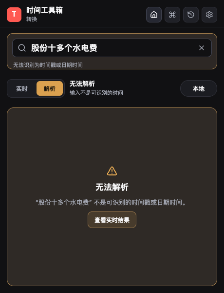

# 时间工具箱

面向开发者的 Chrome MV3 时间工具扩展，提供时间戳解析、日期时间转换、时区预览、常用格式复制、右键解析、快捷键唤起和最近记录管理。界面采用 Raycast 风格，适合在开发、排障、日志分析和接口联调时快速处理时间数据。

## 界面预览

| 实时结果 | 解析时间戳 |
| --- | --- |
|  |  |

| 输入校验 | 复制反馈 |
| --- | --- |
|  |  |

## 功能特性

- **时间戳解析**：自动识别秒、毫秒、微秒、纳秒时间戳。
- **日期时间转换**：支持 `YYYY-MM-DD`、`YYYY-MM-DD HH:mm:ss`、ISO 等可被浏览器识别的日期时间输入。
- **实时结果**：未输入内容时持续显示当前时间，并实时更新秒级结果。
- **多格式复制**：一键复制 Unix 秒、Unix 毫秒、日期时间、日期、ISO、UTC、RFC 2822 和文件名安全格式。
- **时区切换**：支持本地、UTC、上海、洛杉矶、伦敦、东京。
- **最近记录**：本机保存最近 30 条解析历史，便于回看和恢复。
- **右键菜单**：选中网页文本后，可通过右键菜单直接用时间工具箱解析。
- **快捷键唤起**：默认支持 `Ctrl+Shift+Y`，macOS 下为 `Command+Shift+Y`。
- **命令面板**：通过 `Ctrl/Command + K` 搜索格式、历史记录和页面导航。
- **主题设置**：支持跟随系统、深色、浅色主题。
- **剪贴板读取**：默认关闭；启用后会请求 Chrome 可选权限 `clipboardRead`。

## 安装使用

### 从源码加载

```bash
pnpm install
pnpm build
```

然后在 Chrome 中加载构建产物：

1. 打开 `chrome://extensions/`。
2. 开启右上角「开发者模式」。
3. 点击「加载已解压的扩展程序」。
4. 选择项目生成的 `dist` 目录。

### 日常使用

1. 点击浏览器工具栏中的「时间工具箱」图标。
2. 输入时间戳或日期时间，自动进入解析模式。
3. 在结果列表中点击复制按钮获取目标格式。
4. 通过顶部时区下拉菜单切换展示时区。
5. 使用历史、设置和命令面板完成高频操作。

## 支持的输入与输出

### 输入示例

```text
1701600564
1701600564000
1701600564000000
1701600564000000000
2023-12-03
2023-12-03 18:49:24
2023-12-03T10:49:24.000Z
```

### 输出格式

| 格式 | 示例 |
| --- | --- |
| Unix 秒 | `1701600564` |
| Unix 毫秒 | `1701600564000` |
| 日期时间 | `2023-12-03 18:49:24` |
| 日期 | `2023-12-03` |
| ISO | `2023-12-03T10:49:24.000Z` |
| UTC | `2023-12-03 10:49:24 UTC` |
| RFC 2822 | `Sun, 03 Dec 2023 10:49:24 GMT` |
| 文件名 | `2023-12-03_18-49-24` |

## 权限说明

| 权限 | 用途 |
| --- | --- |
| `storage` | 保存设置、最近记录和待解析的选中文本。 |
| `contextMenus` | 创建网页选中文本的右键解析入口。 |
| `clipboardRead` | 可选权限，仅在启用「自动读取剪贴板」时请求。 |

最近记录保存在 `chrome.storage.local`，设置保存在 `chrome.storage.sync`。清空历史不会影响同步设置。

## 开发

```bash
pnpm dev
```

监听构建扩展文件，适合配合 Chrome 扩展页重新加载调试。

```bash
pnpm dev:server
```

启动 Vite 开发服务器，适合调试页面布局和样式。

```bash
pnpm lint
pnpm format
pnpm build
```

分别执行静态检查、格式化和生产构建。

## 项目结构

```text
.
├── public/manifest.json          # Chrome MV3 清单
├── src/background/               # Service Worker 与右键菜单
├── src/options/                  # 设置页入口
├── src/popup/                    # Popup 主界面
├── src/shared/                   # 时间处理、存储、主题和类型定义
├── src/styles/                   # 全局样式
├── screenshots/                  # README 界面截图
├── popup.html                    # Popup HTML 入口
├── options.html                  # 设置页 HTML 入口
└── vite.config.ts                # Vite 构建配置
```

## 技术栈

- React 19
- TypeScript 5
- Vite 7
- Chrome Extension Manifest V3
- lucide-react
- oxlint / oxfmt

## 许可证

本项目基于 [LICENSE](LICENSE) 中声明的许可证发布。
